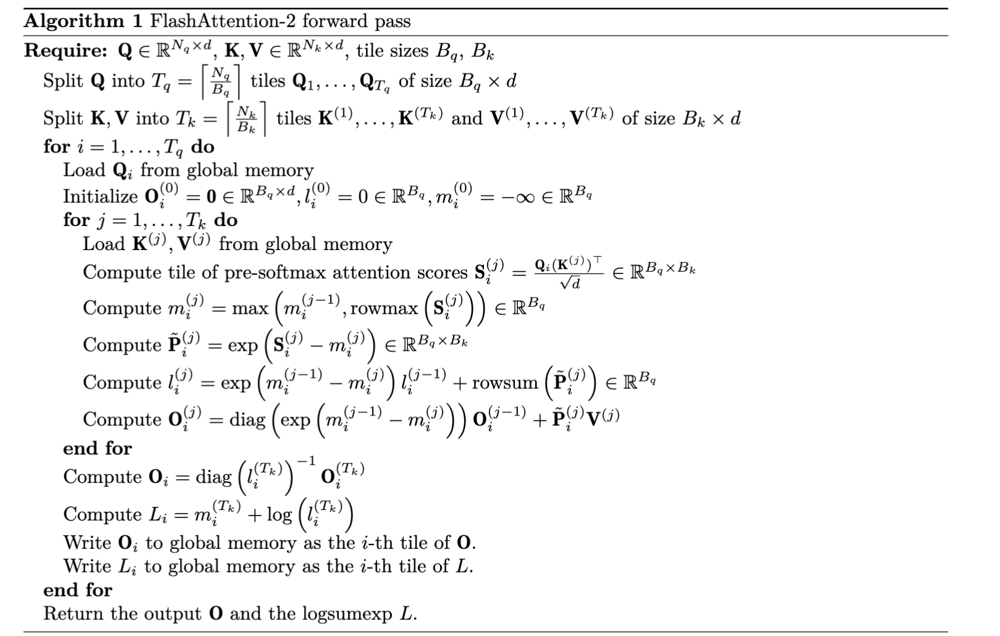

# FlashAttention Implementation

## Overview

FlashAttention is a memory-efficient attention algorithm that avoids materializing the O(N²) attention matrix.

> For Triton implementation details, see [Triton Programming](04_Triton_Programming.md).

---

## Why torch.compile Has Modest Speedups

**torch.compile** is a feature in PyTorch 2.0 that JIT-compiles PyTorch code into optimized kernels.

### How It Works

```
Python/PyTorch code
        ↓
   TorchDynamo (traces code)
        ↓
   TorchInductor (generates Triton)
        ↓
   Compiled GPU kernels
```

### Why Modest Speedups for Transformers

- Core operations like `matmul` and attention are **already highly optimized**
- `torch.compile` shines on **fusible ops** (activations, layernorms, residuals)
- Large matmuls dominate and are often memory-bound
- Observed ~5-11% speedup is typical for Transformers

**For bigger gains:** Try `mode="reduce-overhead"` or `"max-autotune"`.

---

## nn.Module vs torch.autograd.Function

### TL;DR

| Approach | Pros | Cons |
|----------|------|------|
| `nn.Module` | Easy, automatic gradients | Saves full attention matrix → O(N²) memory |
| `torch.autograd.Function` | Full control, custom backward | More complex to implement |

### Why FlashAttention Needs torch.autograd.Function

The memory-efficient algorithm (tiling + recomputation) isn't something PyTorch's automatic differentiation can discover on its own — you must explicitly code the custom forward/backward logic.

```
nn.Module:            Standard attention → saves O(N²) matrix
autograd.Function:    FlashAttention → saves only O(N) → memory efficient!
```

---

## FlashAttention Algorithm

### Key Ideas

1. **Tiled computation** - Process attention in blocks
2. **Online softmax** - Compute softmax incrementally without full matrix
3. **Recomputation** - Don't save attention matrix; recompute in backward pass

### Online Softmax

Standard softmax requires knowing all values to compute the normalization constant. FlashAttention uses **online softmax** to update incrementally:

```
For each new block of keys:
  1. Compute attention scores S_ij = Q_i @ K_j^T / sqrt(d)
  2. Update running maximum: m_new = max(m_old, max(S_ij))
  3. Rescale previous accumulator: O = O * exp(m_old - m_new)
  4. Add new contribution: O += exp(S_ij - m_new) @ V_j
  5. Update normalizer: l_new = l_old * exp(m_old - m_new) + sum(exp(S_ij - m_new))
  6. Final: O = O / l
```

---

## PyTorch Implementation

```python
import torch
import einops
import math

class FlashAttentionPytorch(torch.autograd.Function):
    @staticmethod
    def forward(ctx, Q, K, V, is_causal=False):
        '''
        Forward pass of FlashAttention.
        Q: [batch, Nq, d]
        K: [batch, Nk, d]
        V: [batch, Nk, d]

        Returns:
        O: [batch, Nq, d]
        '''
        ctx.is_causal = is_causal
        BATCH_SIZE, Nq, D = Q.shape
        _, Nk, _ = K.shape

        Q_BLOCK_SIZE = 64
        K_BLOCK_SIZE = 64

        O = torch.zeros_like(Q)
        L = torch.zeros((BATCH_SIZE, Nq), device=Q.device, dtype=Q.dtype)

        # Loop over query blocks
        for i in range(0, Nq, Q_BLOCK_SIZE):
            q_end = min(i + Q_BLOCK_SIZE, Nq)
            Q_i = Q[:, i:q_end, :]

            # Initialize accumulators for this query block
            O_i = torch.zeros_like(Q_i)
            l_i = torch.zeros((BATCH_SIZE, q_end - i), device=Q.device, dtype=Q.dtype)
            m_i = -torch.inf * torch.ones((BATCH_SIZE, q_end - i), device=Q.device, dtype=Q.dtype)

            # Loop over key blocks
            for j in range(0, Nk, K_BLOCK_SIZE):
                k_end = min(j + K_BLOCK_SIZE, Nk)
                K_j = K[:, j:k_end, :]
                V_j = V[:, j:k_end, :]

                # Compute attention scores
                S_i = einops.einsum(Q_i, K_j, 'b nq d, b nk d -> b nq nk') / math.sqrt(D)

                # Online softmax update
                m_i_new = torch.max(m_i, torch.max(S_i, dim=-1).values)
                P_i = torch.exp(S_i - m_i_new.unsqueeze(-1))
                l_i_new = torch.exp(m_i - m_i_new) * l_i + torch.sum(P_i, dim=-1)
                O_i_new = O_i * torch.exp(m_i - m_i_new).unsqueeze(-1) + \
                          einops.einsum(P_i, V_j, 'b nq nk, b nk d -> b nq d')

                l_i = l_i_new
                m_i = m_i_new
                O_i = O_i_new

            # Normalize and store
            O_i = O_i / l_i.unsqueeze(-1)
            O[:, i:q_end, :] = O_i
            L[:, i:q_end] = m_i + torch.log(l_i)

        ctx.save_for_backward(Q, K, V, O, L)
        return O

    @staticmethod
    def backward(ctx, dO):
        # TODO: Implement backward pass
        pass
```

---

## FlashAttention 2 Algorithm



Key improvements in FlashAttention 2:
- Better parallelization across sequence length
- Reduced non-matmul FLOPs
- Better work partitioning

---

## Memory Comparison

| Method | Memory | Speed |
|--------|--------|-------|
| Standard Attention | O(N²) | Baseline |
| FlashAttention | O(N) | 2-4x faster |
| FlashAttention 2 | O(N) | 2x faster than FA1 |

---

## Resources

### Papers

- [FlashAttention: Fast and Memory-Efficient Exact Attention](https://arxiv.org/abs/2205.14135) (Dao et al.)
- [FlashAttention-2: Faster Attention with Better Parallelism](https://arxiv.org/abs/2307.08691)

### Code References

- [Dao-AILab/flash-attention](https://github.com/Dao-AILab/flash-attention)

### Related Notes

- [Triton Programming](04_Triton_Programming.md) - Triton implementation
- [GPU Fundamentals](01_GPU_Fundamentals.md) - Memory hierarchy
- [Matrix Multiplication](05_Matrix_Multiplication.md) - Tiled computation theory
